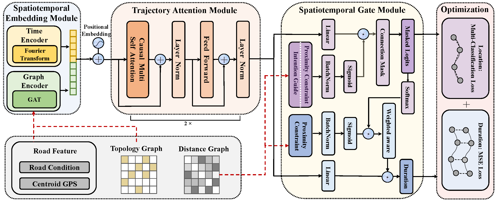

# STEGA

The official implementation of **Spatiotemporal Gated Traffic Trajectory Simulation with Semantic-aware Graph Learning** (Information Fusion 2024).

Please consider giving this repository a star ⭐ if you find it helpful! 😉 



Check out our paper:
> Spatiotemporal Gated Traffic Trajectory Simulation with Semantic-aware Graph Learning. <br/> *Yu Wang, Ji Cao, Wenjie Huang, Zhihua Liu, Tongya Zheng†, Mingli Song*. [[Link](https://www.sciencedirect.com/science/article/pii/S1566253524001829)]

> **<p align="justify"> Abstract:** Traffic trajectories of various vehicles, bicycles and pedestrians can help understand the traffic dynamics in a fine-grained manner like traffic flow, traffic congestion and ride-hailing demand. The comprehensive usage of traffic trajectory data has not been fully investigated due to the prevalent privacy concerns and commercial limitations. The traffic trajectory simulation task has emerged to generate high-fidelity trajectories in demand for downstream tasks to fill the gap between the scarce trajectory data and the widespread applications. Previous state-of-the-art methods build the spatiotemporal dependencies of trajectories with Graph Neural Networks (GNNs) under generative adversarial training, yielding better yet unstable trajectory quality. We observe that the unsatisfied synthetic trajectories are caused by the insufficient spatiotemporal modeling of road networks and trajectory semantics. In this paper, we propose a novel SpatioTEmporal GAted (STEGA) framework equipped with semantic-aware graph learning for traffic trajectory simulation to enable the explicit modeling of spatiotemporal dependencies throughout the learning pipeline. On the one hand, STEGA employs a graph encoder with the semantics of road networks for the spatial points of a trajectory, together with a time encoder for the time points. On the other hand, STEGA devises two spatiotemporal gates with the semantic graphs for the predictions of the future trajectory. Boosted by the semantic-aware graph learning, the proposed STEGA outperforms the state-of-the-art counterparts consistently at both macro- and micro-level metrics on two datasets. Elaborate ablation studies and downstream tasks of the synthetic trajectories further demonstrate the superiority of STEGA. Our code is available at https://github.com/Star607/STEGA.</p>


## 📚 Citation

If you find our work useful in your research, please consider citing 😄:
```
@article{wang2024spatiotemporal,
  title={Spatiotemporal Gated Traffic Trajectory Simulation with Semantic-aware Graph Learning},
  author={Yu Wang, Ji Cao, Wenjie Huang, Zhihua Liu, Tongya Zheng, Mingli Song},
  journal={Information Fusion},
  volume={108},
  pages={102404},
  year={2024},
  issn={1566-2535},
  doi={https://doi.org/10.1016/j.inffus.2024.102404},
  url={https://www.sciencedirect.com/science/article/pii/S1566253524001829}
} 
``` 

## ⚙️ Installation

- Environment
    - Tested OS: Linux
    - Python >= 3.9
    - PyTorch == 1.10.2

- Dependencies
    - Install PyTorch 1.10.2 with the correct CUDA version.
    - Install dgl 1.1.0 with the correct CUDA version.
    - Execute ``pip install -r requirements.txt`` command to install all of the Python modules and packages used in this project.

## 📁 Code Structure 

Data is from the opensource dataset of [TS-TrajGen](https://github.com/WenMellors/TS-TrajGen/tree/master).

  ```
├── data
│   └── BJ_Taxi
│       ├── adjacent_mx_fill.npz.npy
│       ├── adjacent_mx.npz
│       ├── dist_geo.npy
│       ├── node_feature.pt
│       ├── od_and_probs_float.pt
│       ├── rid_gps.json
│       ├── road2grid.json
│       ├── roadmap.geo
│       ├── roadmap.rel
│       ├── start_t_probs.pt
│       ├── traj_tes.csv
│       ├── traj_tra.csv
│       └── traj_val.csv
├── distance_gat_fc.py
├── functional.py
├── graph_model.py
├── helpers.py
├── model.py
├── picture
│   └── framework.png
├── README.md
├── requirements.txt
├── sample.py
└── train.py
  ```
                        
## 🚀 Running

- Model Training
  - `python train.py`
  - `--data` sets the dataset
  - `--datapath` refers to the path of each dataset
  - `--out_dir` is the file directory to save the trained model
  
- Trajectory Simulation
  - `python sample.py`
  - `--data` sets the dataset
  - `--datapath` refers to the path of each dataset
  - `--out_dir` is the file directory to save the trained model and simulated trajectories

## 📃 Related Works

- [COLA: Cross-city Mobility Transformer for Human Trajectory Simulation (WWW '24)](https://github.com/Star607/Cross-city-Mobility-Transformer)                         


## 😊 Note

The implemention is based on *[nanoGPT](https://github.com/karpathy/nanoGPT)*.